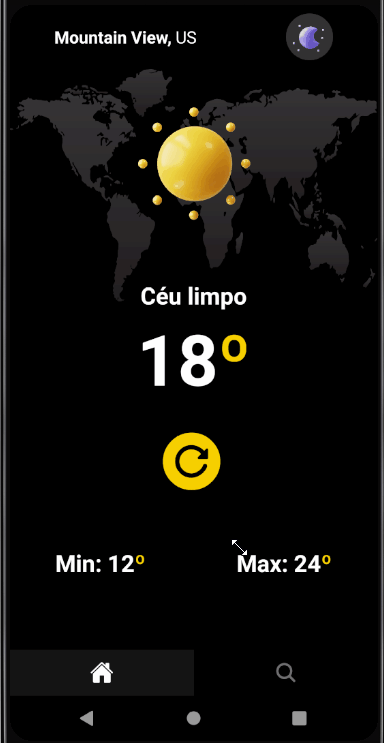
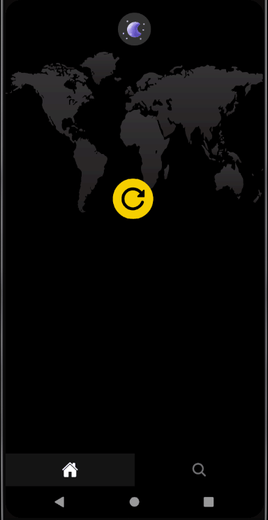

<h1 align="center">Weather APP</h1>

<p align="center">Esse projeto é uma aplicação que exibe os dados climáticos da região do usuário e de cidades escolhidas.</p>

<p align="center">
 <a href="#features">Features</a> •
 <a href="#pré-requisitos">Pré Requisitos</a> •
 <a href="#🎲-rodando-o-front-end">Rodando a aplicação</a> •
 <a href="#🛠-tecnologias">Tecnologias</a> •
 <a href="#autor">Autor</a>
</p>

---

<br>


<h1 align="center">
  
  
  
</h1>


### Features
- [x] Theme Switcher
- [x] O tema é mantido
- [x] Ícones mudando de acordo com o clima, [Weatherly 3D Icons](https://piqodesign.gumroad.com/?query=weather&sort=page_layout#kSiNv)
- [x] Consumo da API de clima
- [x] Consumo da localização do usuário
- [x] Botão para recarregar os dados
- [x] Busca por cidades
- [x] Tratativa de erros

### Pré-requisitos

Antes de começar, você vai precisar ter instalado em sua máquina as seguintes ferramentas:
[Git](https://git-scm.com), [Node.js](https://nodejs.org/en/).

Você também vai precisar configurar o ambiente para desenvolvimento mobile no seu PC: [Configurando Ambiente React Native](https://react-native.rocketseat.dev/).

Além disto é bom ter um editor para trabalhar com o código como [VSCode](https://code.visualstudio.com/)


### 🎲 Rodando o Mobile

```bash
# Clone este repositório
$ git clone https://github.com/ARTHURPC03/WeatherApp

# Acesse a pasta do projeto no terminal/cmd
$ cd WeatherApp

# Faça uma cópia de '.env.example' para '.env'
# Coloque sua credencial da API de clima (Weather API)
$ cp .env.example .env

# Instale as dependências
$ yarn

# Se você for emular com o Android, execute este comando
# Certifique-se de ter o emulador aberto
$ yarn android

# Se você for emular com ios, execute este comando
$ yarn ios
```


### 🛠 Tecnologias

As seguintes ferramentas foram usadas na construção do projeto:

- [TypeScript](https://www.typescriptlang.org/)
- [React Native](https://reactnative.dev/)
- [Weather API](https://openweathermap.org/api)
- [Context API](https://pt-br.reactjs.org/docs/context.html)
- [React Native Geolocation Service](https://github.com/Agontuk/react-native-geolocation-service)
- [React Navigation](https://reactnavigation.org/)
- [React Native Vector Icons](https://github.com/oblador/react-native-vector-icons)
- [UnForm](https://unform.dev/)
- [Yup](https://github.com/jquense/yup)
- [Styled Components](https://styled-components.com/)
- [Axios](https://github.com/axios/axios)
- [Eslint](https://eslint.org/)
- [Prettier](https://prettier.io/)
- [EditorConfig](https://editorconfig.org/)


---

### Autor


Made with 💜 by ARTHUR PC 👋

[](https://www.linkedin.com/in/arthurpc03/)
[](https://www.youtube.com/arthurpc)
